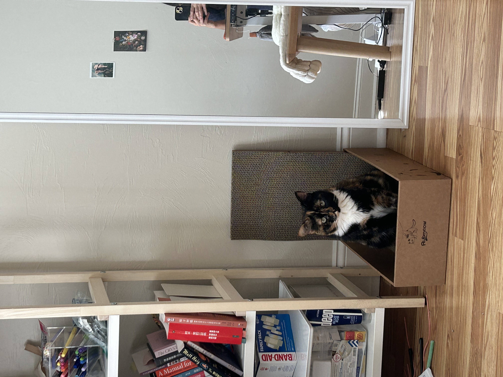

| [home page](https://jessiemar-mar.github.io/jessiemar-portfolio/) | [data viz examples](dataviz-examples) | [critique by design](critique-by-design) | [final project I](final-project-part-one) | [final project II](final-project-part-two) | [final project III](final-project-part-three) |

# Portfolio
This is my public portfolio for Telling Stories with Data at CMU!  Here's where all my cool work will go.  You should probably hire me. 

# About me
Hello! My name is **Jessie Mar**, a second-year **Arts Management student** with a background in photography. I’ve always been drawn to the power of visual storytelling, and I’m **passion about finding creative ways to connect more people with art**. My career goal is to work in marketing for a museum, gallery, or a marketing agency that focuses on the arts and cultural sector.

When I’m not studying or working, I’m usually hanging out with my eight-year-old cat, trying to keep my one surviving plant alive, exploring new exhibitions, traveling, or getting my hands messy with ceramics.

# What I hope to learn
Here are the things I want to learn in this course and to apply these skills in marketing strategy, branding, mapping, audience segmentation, and survey design.

1. **Different types of chart, diagram and graph**: Efficiently and effectively using them for different context to support data and decision.

2. **Decision Making in Contextual Awareness and Design Execution**: Considering cultural, historical, and functional contexts to determine which design elements are necessary and which are not, while keeping the main goal—what I want to convey to the audience—at the center.

3. **Data Visualization in Motion**: Exploring how motion can be used to enhance storytelling with data and capture the audience’s attention.

# Portfolio

- Data Visualization Workshops
- Final Project

# Examples
You can keep this section for stuff from in-class demos or your other work, or remove it. 

## Assignment: [Visualizing overnment Debt](https://jessiemar-mar.github.io/jessiemar-portfolio/dataviz-examples)

## Assignment 3&4: [Critique by Design](https://jessiemar-mar.github.io/jessiemar-portfolio/critique-by-design) 

## Final project
My project will explore how museums can successfully manage their exhibition departments while establishing digital collection platforms, particularly in response to rising digital engagement. Exhibitions are often the driving force of museums — shaping audience experience, educational outreach, and revenue generation. Yet, sustaining them requires robust funding and efficient management.

[Part I](https://jessiemar-mar.github.io/jessiemar-portfolio/final-project-part-one)
[Part II](https://jessiemar-mar.github.io/jessiemar-portfolio/final-project-part-two)
[Part III](https://jessiemar-mar.github.io/jessiemar-portfolio/final-project-part-three)

---
## Other stuff you can do (you can remove this section - it's just for your reference.)

### Changing text

You can change text, like this: 

**Here's some bold** text.  Here's some *italic* text. Here's some ~~strikethrough~~ text. 

### Creating tables

You can build tables like this: 

| Name         | Type of pet | Favority activity 1 | FA 2   | FA 3            | FA 4                                |
|--------------|-------------|---------------------|--------|-----------------|-------------------------------------|
| Eli          | cat         | Sleeping            | Eating | Being pet       | Plotting to overthow dog empire     |
| Howard       | dog         | You                 | You    | You             | Eating                              |
| Frankenstein | fish        | Swimming            | Eating | Blowing bubbles | Forgetting                          |

An easy-to-use template generator tool [can be found here](https://www.tablesgenerator.com/markdown_tables)

You can use different headings, like this: 

# Here's a large title (H1)
## Here's a subtitle (H2)
### ...and so on (H3)
You get the idea - just don't forget the space between the # and your title.  `#Title` won't work, but `# Title` will. 

### Adding images

Here's an example of how to add an image to my portfolio.  

> Photo by <a href="https://unsplash.com/pt-br/@charlesdeluvio?utm_source=unsplash&utm_medium=referral&utm_content=creditCopyText">charlesdeluvio</a> on <a href="https://unsplash.com/photos/K4mSJ7kc0As?utm_source=unsplash&utm_medium=referral&utm_content=creditCopyText">Unsplash</a>
  

Alternately, you can set the size of the image using just a bit of HTML: 

Remember that you'll need to upload the image into your repository, or include a link to the image somewhere else.  

### Setting up a separate page

So here's the code you'll need to add to your own site to create a second page. 

1. First, create a new page in your repository (for example, dataviz1.md)
2. Next, add a link to that page by inserting the following into your readme.md page:

`[title](dataviz)` or `[dataviz](https://cmustudent.github.io/portfolio/dataviz.html)` or `[CMU](https://www.cmu.edu)`

Any of those formats will work. Here's some examples of working links: 

`[title](dataviz)` = [title](dataviz)  
`[dataviz](https://cmustudent.github.io/portfolio/dataviz.html)` = [dataviz](https://cmustudent.github.io/portfolio/dataviz.html)  
`[CMU](https://www.cmu.edu)` = [CMU](https://www.cmu.edu)   

Make sure to check these from your publicly accessible URL to make sure they're working correctly (not from the preview tab). 

Looking for more?  A nice Markdown guide [can be found here](https://www.markdownguide.org/cheat-sheet/)

## References
_List any references you used here._

## AI acknowledgements
_If you used AI to help you complete this assignment (within the parameters of the instruction and course guidelines), detail your use of AI for this assignment here._

