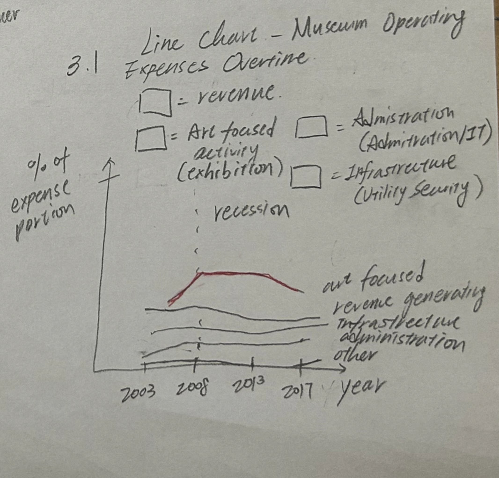

| [home page](https://cmustudent.github.io/tswd-portfolio-templates/) | [data viz examples](dataviz-examples) | [critique by design](critique-by-design) | [final project I](final-project-part-one) | [final project II](final-project-part-two) | [final project III](final-project-part-three) |

> Important note: this template includes major elements of Part I, but the instructions on Canvas are the authoritative source.  Make sure to read through the assignment page and review the rubric to confirm you have everything you need before submitting.  When done, delete these instructions before submitting.

# Outline
>Include a high-level summary of your project.  This should be a couple paragraphs that describe what you're interested in showing with your final project. 

My project will explore how museums can successfully manage their exhibition departments while establishing digital collection platforms, particularly in response to rising digital engagement. Exhibitions are often the driving force of museums — shaping audience experience, educational outreach, and revenue generation. Yet, sustaining them requires robust funding and efficient management.

In addition, major museums are increasingly investing in digital collections to expand access, allowing the public to engage with artworks online for research, education, and pre-visit planning. This digital expansion, however, depends on increased awareness and financial support from donors and stakeholders.

Through this project, I aim to highlight the importance of exhibitions and digital collections as essential components of museum sustainability. I will use data on audience participation, museum contributions to the economy, exhibition costs within museum budgets, and survey responses to digital collections. By presenting these insights, I hope to show why increased investment in exhibition departments and digital infrastructure is necessary for the future of museums.
 

> A project structure that outlines the major elements of your story.  Your Good Charts text talks about story structure in Chapter 8 - you should describe what you hope to achieve.  Make sure the outline is detailed enough that we can see how you anticipate your story unfolding.  You can incorporate your Story Arc from the in-class exercise along with your user stories and one sentence summary to make the topic even more clear. 

## Project Structure
### 1. Beginning – Arts and Museums as Economic and Cultural Drivers
- **State-Level Estimates of the Arts’ Economic Value and Employment (2001–2023)**: Value added to each state’s economy by the arts.
- **U.S. Arts and Cultural Production Satellite Account**: Type of production of arts and cultural goods and their contribution to the U.S. economy and annual growth.
- Framing Point: Arts and culture are not just leisure activities — they are major contributors to the economy and employment, making museums vital players in this ecosystem.

### 2. Importance of Museums – Public Participation and Engagement
- **2020 Arts Basic Survey**: Forms of arts participation (Attend or Visit Art vs. Use a Device to Access Art). Selected from Top 10 states based on SMU DataArts Arts Vibry ranking in 2024. 
- Framing Point: Museums are a key touchpoint for cultural participation, proving their relevance to both local and national audiences.

### 3. Exhibitions as the Core of Museums
- **Art Museums by the Numbers 2018 (AAMD)**: Museum operating budgets highlight exhibitions as a central function, representing the largest proportion of overall expenses.
- **Occupations & Staffing (DataUSA)**: Occupations by industries, salaries, major, education levels in archivists, curators, and museum technicians. 
- Framing Point: Exhibitions are resource-intensive, driving staffing needs and budgets, and thus must remain a priority in museum planning and funding.

### 4. Evolution of Digital Collections – Expanding Access and Expectations
- **Major Museum Digital Collections**: Data from leading museums with open access — MoMA, The Met, National Gallery of Art, and the Cleveland Museum of Art — consolidating the number of artworks online by category, average year, and artistic genre.
- **Audience Expectations of Museums Online**: Public attitudes toward digital access and museum websites.
Framing Point: Digital collections are increasingly viewed as core infrastructure for museums, expanding access beyond physical visitors. 

### 5. Conclusion – Why Funding and Awareness Matter
Synthesis:
- Arts = mMjor economic and cultural sector
- Museums = Participation hubs
- Exhibitions = Operational core
- Digital collections = Further accessibility 

Call to Action: To maintain relevance and accessibility, museums must secure funding and raise awareness for both exhibitions and digital infrastructure. Stakeholders — including philanthropists, donors, and newly established museums — should view these areas as investments in education, research, and long-term audience engagement.

## Initial sketches
> Post images of your anticipated data visualizations (sketches are fine). They should mimic aspects of your outline, and include elements of your story.  

#### State-Level Estimates of the Arts’ Economic Value and Employment (2001–2023)

#### U.S. Arts and Cultural Production Satellite Account

#### 2020 Arts Basic Survey

### Art Museums by the Numbers 2018 (AAMD)

#### Occupations & Staffing (DataUSA)

#### Major Museum Digital Collections

#### Audience Expectations of Museums Online

# The data
> A couple of paragraphs that document your data source(s), and an explanation of how you plan on using your data. 

My project draws from federal surveys, museum field reports, and open-access collections to examine how exhibitions and digital platforms sustain museums. From the NEA and BEA, I will use the State-Level Estimates of the Arts’ Economic Value and Employment (2001–2023) and the U.S. Arts and Cultural Production Satellite Account to show how the arts contribute to GDP, employment, and growth. The Arts Basic Survey (2020) and state-level reports (10 States Study and State of the Arts 2024) provide participation patterns, framing museums as central to cultural engagement. To analyze museum operations, I will use AAMD’s Art Museums by the Numbers 2018 and DataUSA profiles on museums and museum professionals. These sources highlight exhibitions as a major budget item and staffing driver. Finally, I will draw from open-access datasets at MoMA, The Met, the National Gallery of Art, and the Cleveland Museum of Art, alongside survey data on visitor expectations anbout museum websites. These demonstrate the expansion of digital collections and the growing demand for online access.

> A link to the publicly-accessible datasets you plan on using, or a link to a copy of the data you've uploaded to your Github repository, Box account or other publicly-accessible location. Using a datasource that is already publicly accessible is highly encouraged.  If you anticipate using a data source other than something that would be publicly available please talk to me first. 

| Name | URL | Description |
|------|-----|-------------|
|      |     |             |
|      |     |             |
|      |     |             |

# Method and medium
> In a few sentences, you should document how you plan on completing your final project. 

Text here...

## References
_List any references you used here._

## AI acknowledgements
_If you used AI to help you complete this assignment (within the parameters of the instruction and course guidelines), detail your use of AI for this assignment here._
