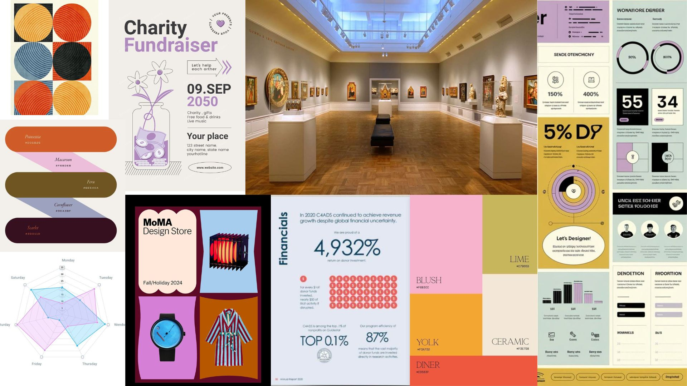
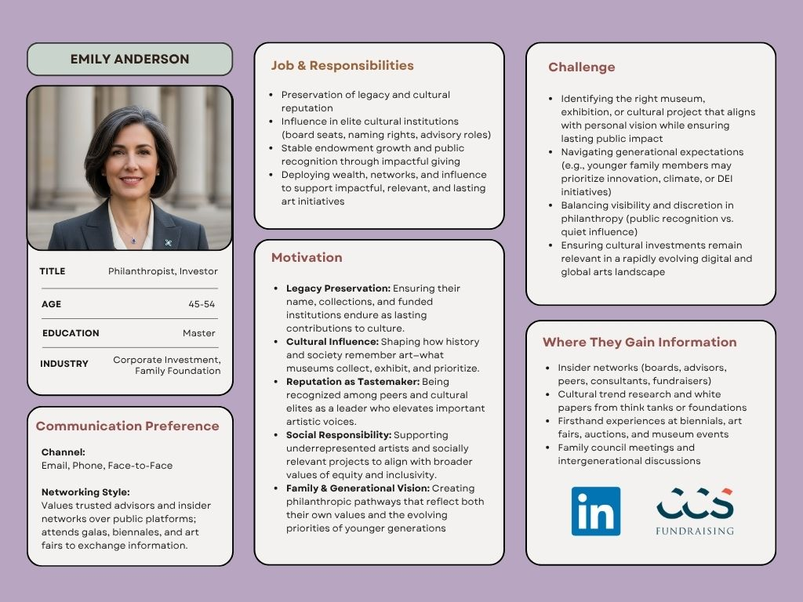

| [home page](https://cmustudent.github.io/tswd-portfolio-templates/) | [data viz examples](dataviz-examples) | [critique by design](critique-by-design) | [final project I](final-project-part-one) | [final project II](final-project-part-two) | [final project III](final-project-part-three) |

# Wireframes / storyboards

Storyboard on [Shorthand](https://preview.shorthand.com/RDyl2xuC3AAvIsN2) 

(Note: I couldn't publish due the requirement of team-lead permission, therefore this link is directed to the preview mode, I also sent an invitation to professor's email)

I’m planning to refine the color palette and add context on the proposed strategies with supporting facts.

# User research 

## Target audience
My approach was to identify individuals who represent potential supporters of museums, including philanthropists, cultural leaders, and community stakeholders. I hope to reach audiences who may not fully recognize how art contributes to employment and the economy, particularly through museums and exhibitions. At the same time, I want to show how the rise of digital technology creates new opportunities for digital collections, expanding access and strengthening the relevance of exhibitions for future generations.

## Interview script

| Goal | Questions to Ask |
|------|------------------|
| Assess the clarity and usability of the data visualizations. This determines whether the visual design choices (colors, chart types, labels) support comprehension or create distractions for the audience. | Do you feel any distraction or confusion when looking at the charts (color, chart types, labels)? Please tell me which graphs and parts. |
| Evaluate whether the core narrative of the presentation is clear. This identifies if the emphasis on museum exhibitions and funding aligns with what the audience perceives as the main takeaway. | What message do you feel was emphasized most strongly throughout the story? |
| Identify gaps or missing elements in the storyline. Responses highlight whether additional context—such as education, community impact, or comparisons with other industries—would strengthen persuasiveness. | What other information or perspectives would help make this story more complete or convincing for you? |
| Test the effectiveness of the opening hook. This examines whether presenting the arts’ economic contribution captures attention and reshapes perceptions of the importance of museums. | When you look at the chart (very first one) showing the arts’ contribution to state economies, what does it tell you? Does it change how you think about museums’ value? |
| Evaluate whether the data on wages and staffing communicates professional expertise. This measures if the audience views curators as essential professionals whose work merits investment. | When you see a chart (last second) on average wages and workforce size in arts management, does it highlight the value of curators’ expertise needed in museums? |
| Assess the audience’s response to the digital collections argument. This identifies whether digital access is perceived as an essential investment for the future of museums or as a less compelling priority compared to physical exhibitions. | How convincing is the case for investing in digital collections and websites? |

## Interview findings

| Questions | Interview 1 — MAM (23, Visual Art) | Interview 2 — MAM (23, Theatre) | Interview 3 — MAM (26, Theatre) | Interview 4 — Fine Art Painter (33) |
|---|---|---|---|---|
| **Do you feel any distraction or confusion when looking at the charts (color, chart types, labels)? Please tell me which graphs and parts.** | Only for the first one I was trying to read the title to know what the numbers represent. Had a hard time navigating the employment part on the right — maybe it’s small. | National Gallery of Art, Art Institute of Chicago, MoMA; Arts Management Average Wage & Population Based on Occupations. | No problem with most charts. For Visitor Preference pie charts, consider colors—colorblind users may have difficulty. | Add more color contrast in “2023 Top 10 Most Culturally Vibrant States’ Arts’ Economic Value and Employment” and “Arts Management Average Wage & Population Based On Occupations.” |
| **What message do you feel was emphasized most strongly throughout the story?** | Audience engagement is trending more digital than physical; people prefer digital. | Diversity of artists in major museums. | Decline of museums’ economic output and attendance, which seems counter to the “good investment” argument. | Factors that make arts & culture important to state economies; curators and art jobs pay well. |
| **What other information or perspectives would help make this story more complete or convincing?** | Everything makes sense. I wonder if the first graph (top 10 state economic value & employment) is necessary—employment is fine but might be a sidetrack. | Broad perspectives but concise presentation; it brings the story together. | You describe a gap as an investment opportunity; specify the type of investment opportunity, then prove it with graphs. Starting with text instead of a graph may feel less intimidating. | Clear statements at the beginning and the end. |
| **When you look at the first chart (arts’ contribution to state economies), what does it tell you? Does it change how you think about museums’ value?** | It suggests museums aren’t adding a lot of economic value, though they have many audiences (most museums are nonprofit). The numbers are lower than I imagined. | Yes—especially the difference between states on the left and right. | Interesting that California is ahead of New York given NY’s major museums; losing arts would be a significant economic loss to each state. | Clear that California plays a huge role in the arts economy; surprising it’s “bigger” than New York. |
| **When you see the chart on average wages and workforce size in arts management, does it highlight the value of curators’ expertise needed in museums?** | Yes—data suggests curators are very much needed. | Sort of; it can make it look like other occupations have negative value. | A bit confusing—understandable but takes too much effort if the goal is an obvious visual. | Yes, though I’m still struck by how small the number of African artists is in big institutions; I might need more factors to see curators’ importance from this. |
| **How convincing is the case for investing in digital collections and websites?** | Very convincing. Strongest are public participation, visitor preference, and museum attendance charts—already very persuasive. | Very much so, especially the graph on digital technology usage for how audiences engage with art. | Well thought out and provides a good case for digital collections and websites. | Advanced. |

# Identified changes for Part III

| Research synthesis (Findings or observations from interviews) | Anticipated changes for Part III |
|---|---|
| Some charts were confusing to read (small text, hard-to-navigate employment section). | Increase font size, simplify layout, and enlarge sections that were hard to follow. |
| Color choices in certain charts (e.g., Visitor Preference pie charts, Top 10 States chart) may cause difficulty for colorblind viewers or reduce clarity. | Adjust color palette for higher contrast and accessibility. |
| Audiences picked up on different messages: digital engagement, diversity of artists, economic decline, and cultural contribution to state economies. | Refine and clarify the core storyline so the central message is emphasized consistently. |
| The first chart (Top 10 states by economic value) felt unnecessary or distracting to some participants. | Consider removing, simplifying, or reframing this chart to better support the main argument. |
| Some interviewees asked for more detail on the type of “investment opportunity” being proposed. | Add explicit explanation of the investment area (e.g., digital collections, curatorial expertise) early in the story. |
| The chart on average wages and workforce size was seen as confusing; not all participants found curators’ importance clearly highlighted. | Add annotations or text to connect the chart more directly to the value of curators. |
| Strong agreement that the case for investing in digital collections and websites is convincing. | Emphasize digital participation trends more clearly and strengthen with additional supporting data. |

I’ll add insights from an art consultant’s perspective, then wrap up with practical strategies and a call to action that integrates the evidence.

# Moodboards / personas

## References
_List any references you used here._

## AI acknowledgements
Uase of ChatGPT:
- Refine my interview questions and suggest additional ones.
- Improve the fluency and clarity of the HubSpot persona I drafted.
- Identify additional research insights I hadn’t considered.

I used Gemini to generate the profile image for my persona.

